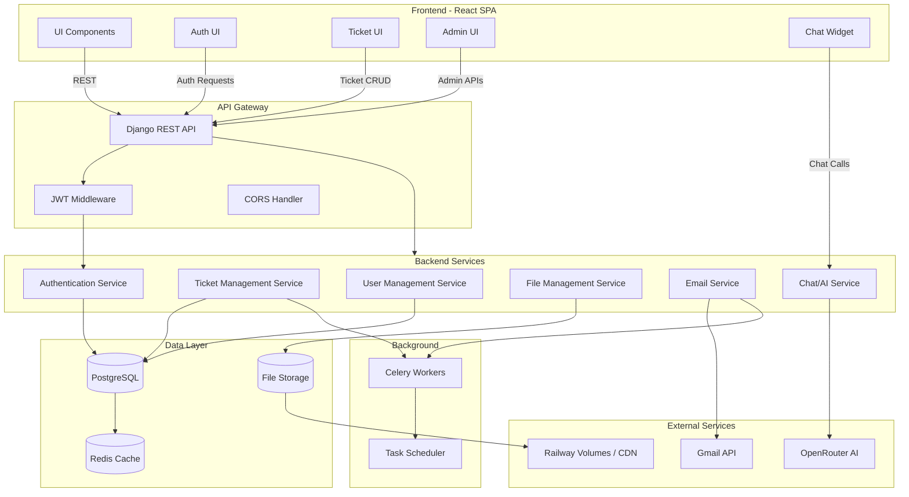

# Part 4.4 - Application Architecture

## 4.4 Application Architecture

Purpose
-------
This document presents the component-level architecture of the SmartSupport application following the Visual Paradigm component diagram conventions. It describes components, provided/required interfaces, connectors, and the responsibilities of each component. The objective is to provide a clear, implementation-oriented map of the system that developers and architects can use for design, integration, and maintenance.

Notation & Conventions
----------------------
- Components: logical units that encapsulate implementation (services, modules, subsystems).
- Provided Interface (<<provide>>): functionality offered by a component.
- Required Interface (<<require>>): functionality a component depends on.
- Connector / Dependency: a directed relationship where one component uses services from another.
- The diagrams use Mermaid flow notation to represent components and their connections. Where appropriate, provided/required interfaces are listed in tables for clarity.

---

## 4.4.1 Component Diagram (High-level)

Description
-----------
High-level components show the main subsystems: Frontend (React SPA), API Gateway, Backend Services (user, ticket, auth, file, email, chat/AI), Data Layer (Postgres, storage, cache), Background Workers (Celery), and External Services (Gmail, OpenRouter, Railway storage). Interfaces and dependencies are shown so implementers know which components to integrate.

### System Component Diagram

### Component Interaction Matrix (Provided / Required Interfaces)

| Component | Provides (interfaces) | Requires (interfaces) |
|-----------|-----------------------|-----------------------|
| Frontend (UI) | UI.Render(), UI.Navigate() | Auth.login(), TicketAPI.*, ChatAPI.* |
| API Gateway | REST endpoints (/api/*) | AuthSvc.TokenValidation(), BizLogic.* |
| Authentication Service (AuthSvc) | Token.issue(), Token.refresh(), User.validate() | DB.userStore |
| User Management (UserSvc) | User.create(), User.read(), User.update() | DB.userStore, EmailSvc.send() |
| Ticket Management (TicketSvc) | Ticket.create(), Ticket.update(), Ticket.query() | DB.ticketStore, FileSvc.store(), EmailSvc.queue() |
| File Management (FileSvc) | File.upload(), File.getSecureUrl() | FileStore, AuthSvc.validate() |
| Email Service (EmailSvc) | Email.send(), Email.queue() | SMTP/Gmail API, Queue (Celery) |
| Chat/AI Service (ChatSvc) | Chat.complete(), Chat.summarize() | OpenRouter API, DB (conversation logs) |
| Background Workers (Celery) | Task.execute() | DB, FileStore, Email API |

---

## 4.4.2 Component Descriptions and Responsibilities

- Frontend (React SPA)
    - Responsibilities: Present UI, route pages, manage client-side state, call API endpoints, show chat widget.
    - Notes: Stores JWT in localStorage, uses token-in-query for secure media or Authorization header fallback.

- API Gateway (Django REST API)
    - Responsibilities: Expose REST endpoints, validate tokens, route requests to service layer, enforce CORS and rate-limiting.

- Authentication Service (AuthSvc)
    - Responsibilities: Authenticate credentials, issue/refresh JWTs, provide token validation endpoints, implement RBAC checks.

- User Management Service (UserSvc)
    - Responsibilities: CRUD for employees, account approval workflow, profile updates, audit logging.

- Ticket Management Service (TicketSvc)
    - Responsibilities: Ticket lifecycle management, attachments, comments, assignment, status transitions, analytics hooks.

- File Management Service (FileSvc)
    - Responsibilities: Validate and store uploads, generate secure URLs (token or header-based), manage thumbnails and file metadata.

- Email Service (EmailSvc)
    - Responsibilities: Queue and send email notifications (Gmail integration), template rendering, retry and failure handling (Celery-backed).

- Chat/AI Service (ChatSvc)
    - Responsibilities: Query external LLMs (OpenRouter), apply system prompts (FAQ), cache responses, optionally store conversation logs.

- Background (Celery)
    - Responsibilities: Execute asynchronous tasks such as sending emails, file processing, analytics jobs.

---

## 4.4.3 Connectors, Protocols and Security

- Communication: HTTPS / REST between frontend and API Gateway.
- Authentication: JWT in Authorization header; some secure media URLs support token-in-query for client-side image rendering. Backend also supports header-based authenticated fetch for media.
- Async Tasks: AMQP/Redis broker for Celery; workers read tasks and interact with DB/FileStore.
- Storage: PostgreSQL for relational data; Railway volumes/CDN for files; Redis for cache and sessions.

Security Considerations
-----------------------
- Tokens are short-lived (access) and refresh tokens are rotated. Refresh requires secure storage.
- File uploads are validated and scanned (size/type limits) before persisting.
- RBAC enforced at API layer and in viewsets.

---

## 4.4.4 Component Mapping to Codebase (Quick reference)

| Component | Key Files / Modules |
|-----------|--------------------|
| API Gateway | `backend/core/urls.py`, `backend/core/views.py` |
| AuthSvc | `backend/core/serializers.py`, `backend/core/views.py` (token views) |
| TicketSvc | `backend/core/views.py` (TicketViewSet), `core/serializers.py` |
| FileSvc | `backend/core/views.py` (`upload_profile_image`), `core/media_utils.py` |
| ChatSvc | `frontend/src/employee/components/modals/chatbot/EmployeeChatbot.jsx`, `core/gmail_utils.py` (integration hints) |

---

## 4.4.5 Usage Examples

1. Ticket creation: Frontend -> POST /api/tickets/ -> TicketSvc creates record -> Celery enqueues email notification -> EmailSvc sends to admins.
2. Protected file access: Frontend requests file URL -> FileSvc generates secure URL or client performs authenticated fetch -> file served from FileStore.

---

Document Version: 1.1  
Last Updated: October 2025  
Prepared By: Application Architecture Team