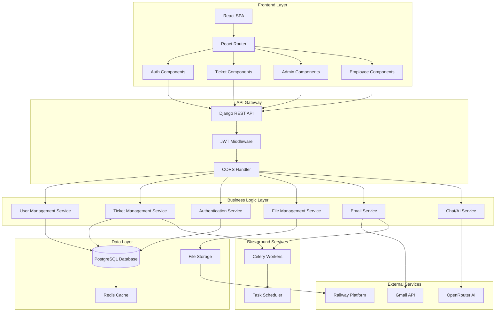
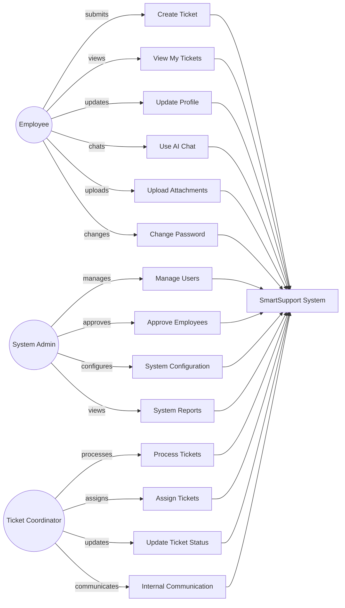
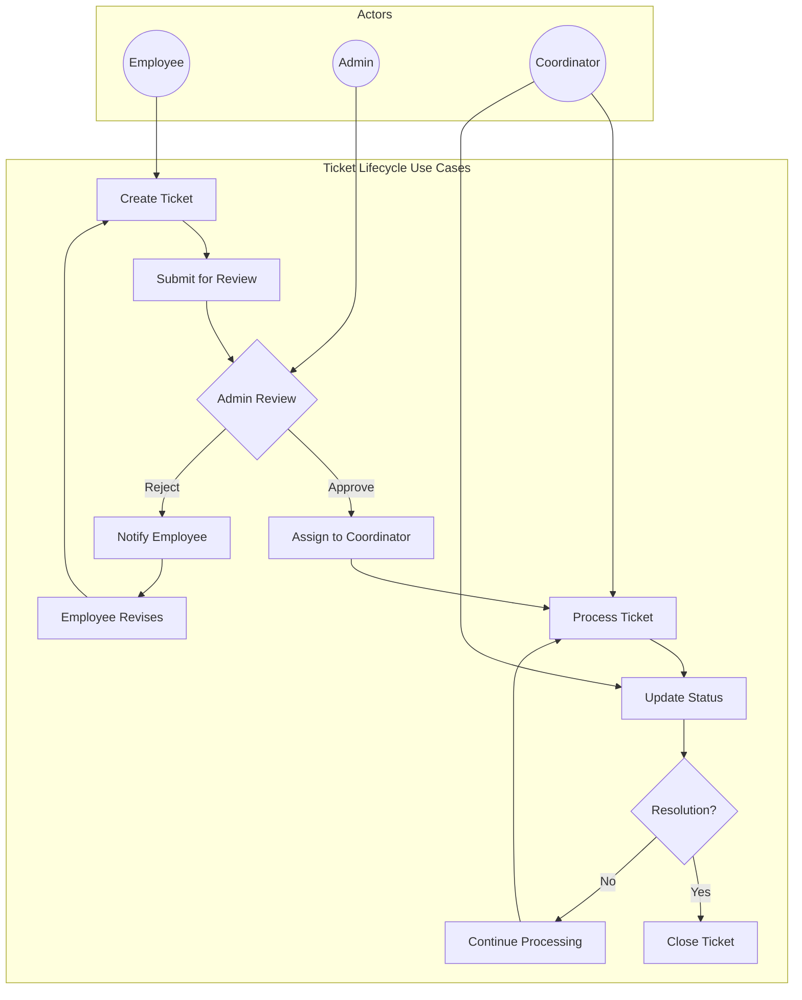
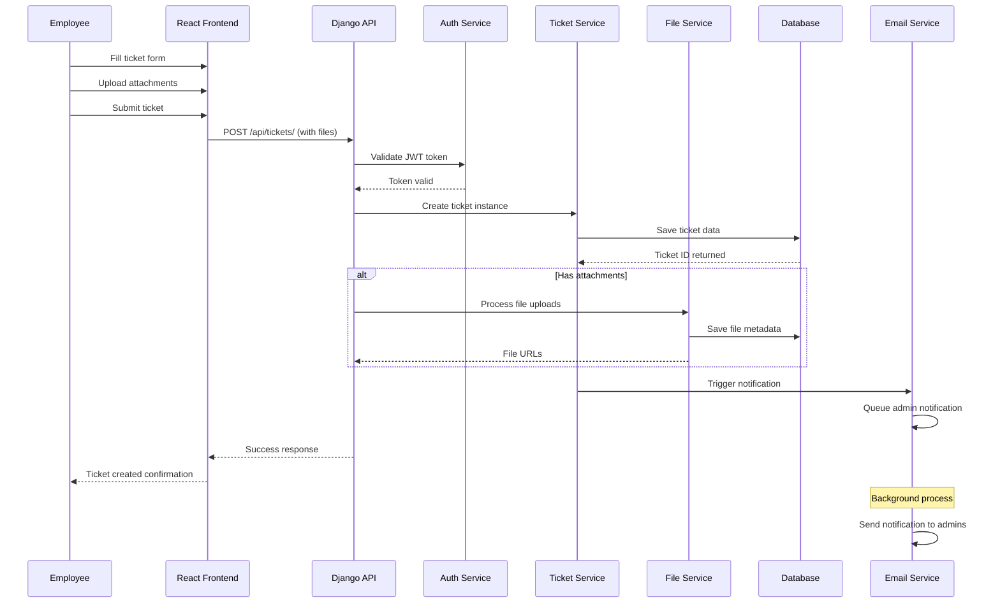
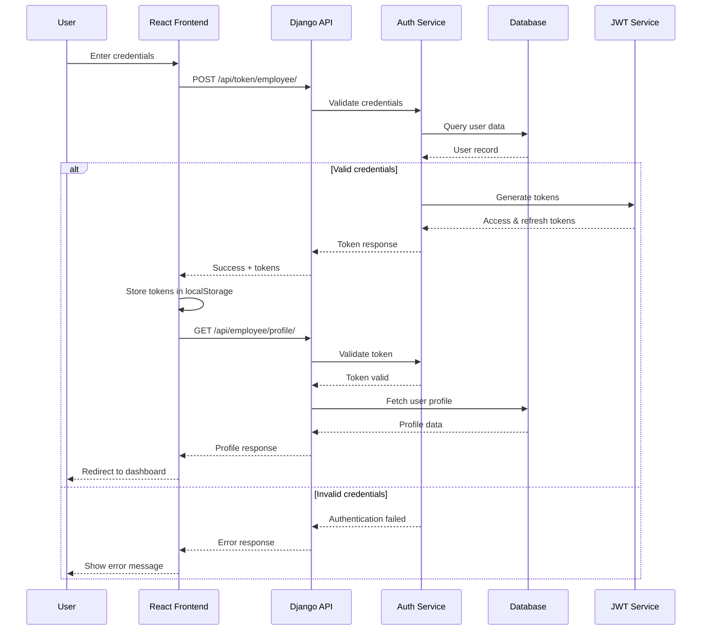
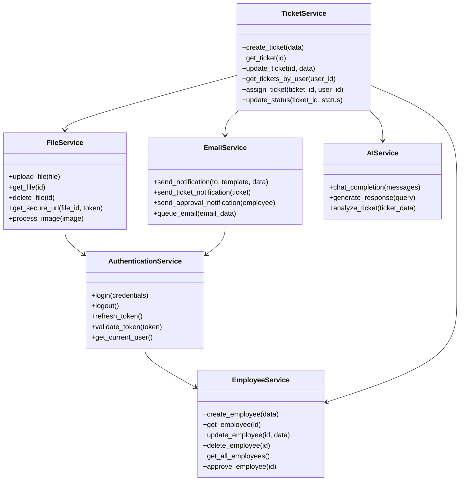
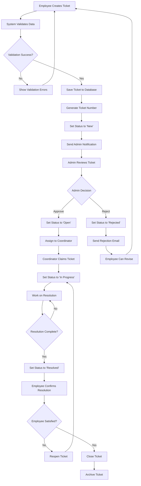
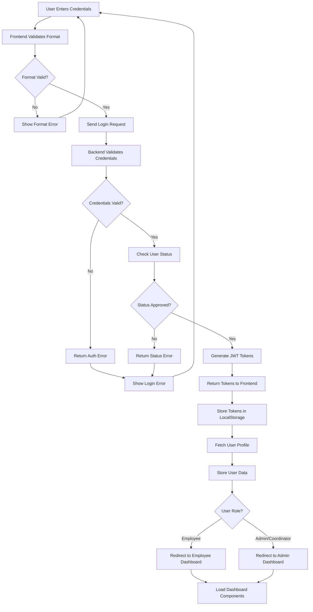

# Part 4.4 - Application Architecture

## 4.4 Application Architecture

This section provides a comprehensive view of the SmartSupport application architecture, including component diagrams and detailed UML diagrams for key services.

---

## 4.4.1 Component Diagram (Show all services and their high-level interactions)

### System Overview Component Diagram



### Service Interaction Matrix

| Service | User Mgmt | Ticket Mgmt | Auth | File Mgmt | Email | Chat/AI | Database | External APIs |
|---------|-----------|-------------|------|-----------|-------|---------|----------|---------------|
| **User Management** | - | Read | Full | None | Trigger | None | Read/Write | None |
| **Ticket Management** | Read | - | Required | Full | Trigger | Integration | Read/Write | Workflow API |
| **Authentication** | Full | Required | - | Required | None | Required | Read/Write | None |
| **File Management** | Required | Full | Required | - | None | None | Read/Write | Cloud Storage |
| **Email Service** | Read | Read | None | None | - | None | Read | Gmail API |
| **Chat/AI Service** | Read | Read | Required | None | None | - | Read | OpenRouter API |

### Component Dependencies

```
┌─────────────────────────────────────────────────────────────┐
│                    Component Dependencies                   │
├─────────────────────────────────────────────────────────────┤
│  Frontend Components                                       │
│  ├── Authentication Components                             │
│  │   ├── Login Form                                        │
│  │   ├── Registration Form                                 │
│  │   └── Password Reset                                    │
│  ├── Employee Dashboard                                    │
│  │   ├── Ticket Creation                                   │
│  │   ├── Ticket List                                       │
│  │   ├── Profile Management                                │
│  │   └── Chat Interface                                    │
│  └── Admin Dashboard                                       │
│      ├── User Management                                   │
│      ├── Ticket Management                                 │
│      ├── System Settings                                   │
│      └── Reports & Analytics                               │
│                                                             │
│  Backend Services                                          │
│  ├── Core Services                                         │
│  │   ├── User Service (CRUD operations)                    │
│  │   ├── Ticket Service (Lifecycle management)            │
│  │   ├── Authentication Service (JWT handling)            │
│  │   └── File Service (Upload/Download)                    │
│  ├── Integration Services                                  │
│  │   ├── Email Service (Gmail integration)                 │
│  │   ├── AI Service (OpenRouter integration)              │
│  │   └── Workflow Service (External system sync)          │
│  └── Infrastructure Services                               │
│      ├── Database Service (PostgreSQL operations)         │
│      ├── Cache Service (Redis operations)                 │
│      └── Background Task Service (Celery)                 │
└─────────────────────────────────────────────────────────────┘
```

---

## 4.4.2 Detailed UML Diagrams for Key Services

### 4.4.2.1 Use Case Diagrams

#### Employee Use Cases



#### Ticket Management Use Cases



### 4.4.2.2 Sequence Diagrams

#### Employee Ticket Creation Sequence



#### Authentication Flow Sequence



### 4.4.2.3 Class Diagrams

#### Core Domain Model

```mermaid
classDiagram
    class Employee {
        +int id
        +string first_name
        +string last_name
        +string middle_name
        +string suffix
        +string email
        +string company_id
        +string department
        +string role
        +string status
        +ImageField image
        +datetime date_created
        +set_password(password)
        +check_password(password)
        +get_full_name()
    }
    
    class Ticket {
        +int id
        +string ticket_number
        +string subject
        +string category
        +string sub_category
        +text description
        +string priority
        +string department
        +string status
        +datetime submit_date
        +datetime update_date
        +JSONField dynamic_data
        +generate_ticket_number()
        +update_status(status)
        +assign_to(employee)
    }
    
    class TicketAttachment {
        +int id
        +FileField file
        +string file_name
        +string file_type
        +int file_size
        +datetime upload_date
        +get_file_url()
        +get_secure_url(token)
    }
    
    class TicketComment {
        +int id
        +text comment
        +boolean is_internal
        +datetime created_at
        +is_editable()
        +format_comment()
    }
    
    Employee ||--o{ Ticket : creates
    Employee ||--o{ Ticket : assigned_to
    Ticket ||--o{ TicketAttachment : has
    Ticket ||--o{ TicketComment : has
    Employee ||--o{ TicketComment : writes
    Employee ||--o{ TicketAttachment : uploads
```

#### Service Layer Architecture



### 4.4.2.4 Activity Diagrams

#### Ticket Processing Workflow



#### User Authentication Activity



---

## Key Architectural Patterns

### 1. **Model-View-Controller (MVC) Pattern**
- **Model**: Django models representing data structure
- **View**: React components for user interface
- **Controller**: Django REST API endpoints for business logic

### 2. **Repository Pattern**
- Service layer abstracts database operations
- Consistent data access patterns across services
- Easier testing and maintenance

### 3. **Authentication & Authorization Pattern**
- JWT-based stateless authentication
- Role-based access control (RBAC)
- Middleware-based security enforcement

### 4. **Observer Pattern**
- Event-driven notifications for ticket updates
- Email notifications triggered by state changes
- Real-time updates using WebSocket potential

### 5. **Strategy Pattern**
- Different handling strategies for various ticket types
- Pluggable file processing strategies
- Configurable notification strategies

---

## Performance Considerations

### Caching Strategy
- **Browser Caching**: Static assets cached for optimal load times
- **API Response Caching**: Frequently accessed data cached in Redis
- **Database Query Optimization**: Selective loading and indexing

### Scalability Patterns
- **Horizontal Scaling**: Load balancing across multiple instances
- **Vertical Scaling**: Resource allocation based on demand
- **Database Scaling**: Read replicas for query distribution

---

**Document Version**: 1.0  
**Last Updated**: October 2025  
**Prepared By**: Application Architecture Team  
**Status**: Complete