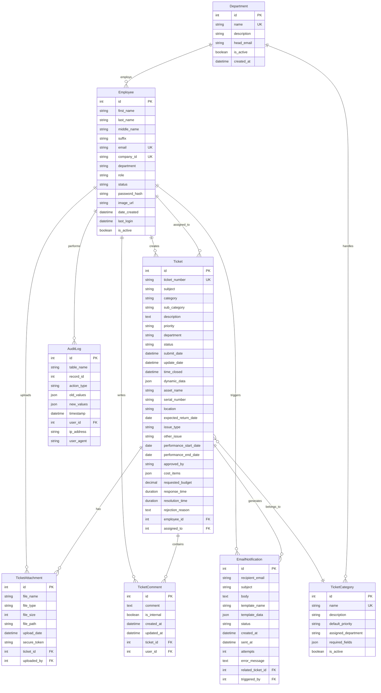
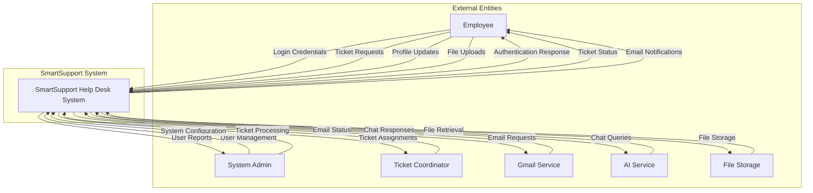
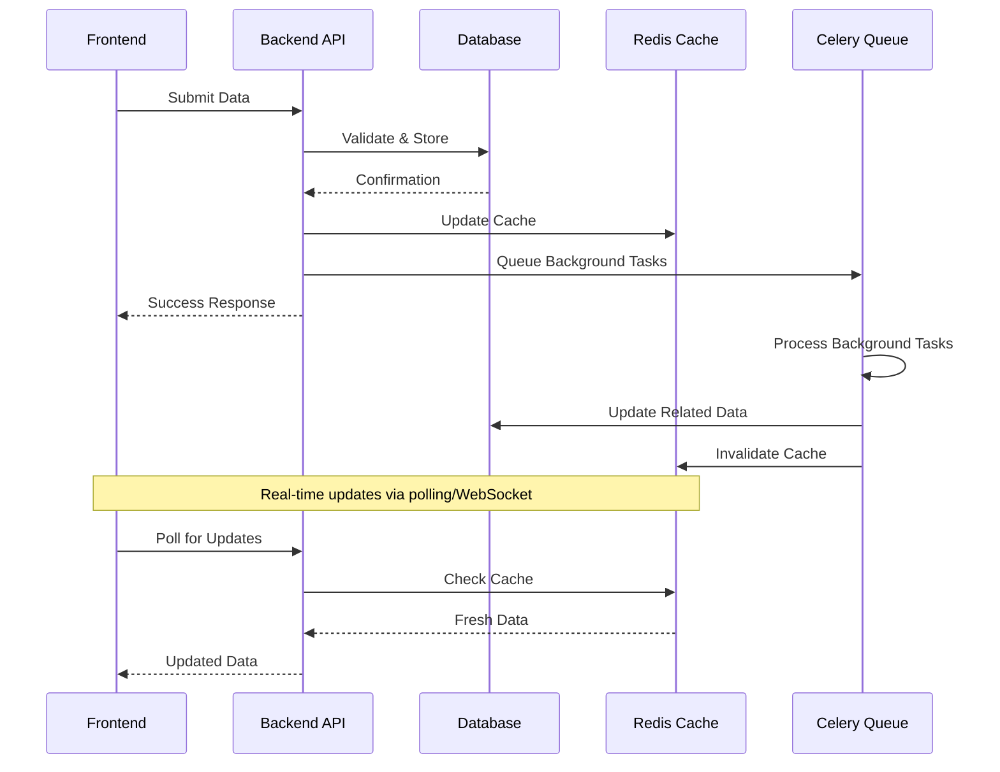
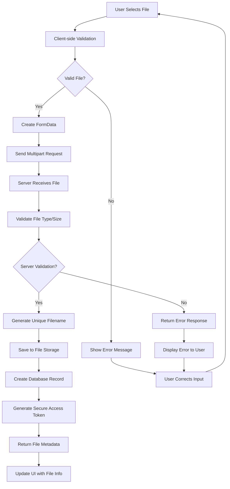
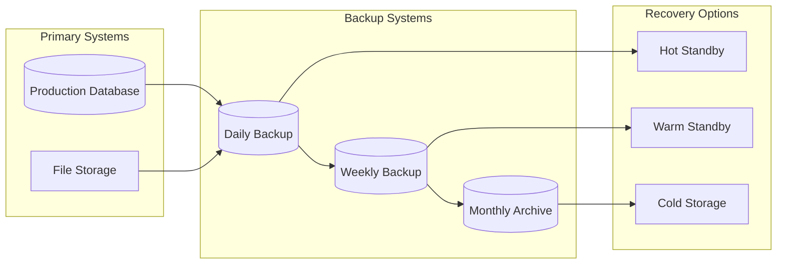

# Part 4.5 - Data Architecture and Design

## 4.5 Data Architecture and Design

This section provides comprehensive documentation of the SmartSupport system's data architecture, including logical and physical data models, data dictionary, and data flow diagrams.

---

## 4.5.1 Logical Data Model (ERD)

### Entity Relationship Diagram



### Logical Model Key Relationships

| Relationship | Type | Cardinality | Business Rule |
|--------------|------|-------------|---------------|
| Employee → Ticket (Creator) | One-to-Many | 1:N | Each employee can create multiple tickets |
| Employee → Ticket (Assignee) | One-to-Many | 1:N | Each coordinator can be assigned multiple tickets |
| Ticket → TicketAttachment | One-to-Many | 1:N | Each ticket can have multiple attachments |
| Ticket → TicketComment | One-to-Many | 1:N | Each ticket can have multiple comments |
| Employee → TicketComment | One-to-Many | 1:N | Each employee can write multiple comments |
| Department → Employee | One-to-Many | 1:N | Each department has multiple employees |
| TicketCategory → Ticket | One-to-Many | 1:N | Each category can have multiple tickets |

---

## 4.5.2 Physical Data Model (Schema)

### Database Schema Definition

#### Employee Table
```sql
CREATE TABLE core_employee (
    id SERIAL PRIMARY KEY,
    first_name VARCHAR(100) NOT NULL,
    last_name VARCHAR(100) NOT NULL,
    middle_name VARCHAR(100),
    suffix VARCHAR(20),
    email VARCHAR(254) UNIQUE NOT NULL,
    company_id VARCHAR(20) UNIQUE NOT NULL,
    department VARCHAR(100) NOT NULL,
    role VARCHAR(50) NOT NULL DEFAULT 'Employee',
    status VARCHAR(20) NOT NULL DEFAULT 'Pending',
    password VARCHAR(128) NOT NULL,
    image VARCHAR(100),
    date_created TIMESTAMP WITH TIME ZONE DEFAULT NOW(),
    last_login TIMESTAMP WITH TIME ZONE,
    is_active BOOLEAN DEFAULT TRUE,
    
    CONSTRAINT chk_role CHECK (role IN ('Employee', 'Ticket Coordinator', 'System Admin')),
    CONSTRAINT chk_status CHECK (status IN ('Pending', 'Approved', 'Rejected', 'Suspended')),
    CONSTRAINT chk_department CHECK (department IN (
        'IT Department', 'Human Resources', 'Finance', 'Operations', 
        'Marketing', 'Sales', 'Customer Service', 'Legal'
    ))
);

CREATE INDEX idx_employee_email ON core_employee(email);
CREATE INDEX idx_employee_company_id ON core_employee(company_id);
CREATE INDEX idx_employee_status ON core_employee(status);
CREATE INDEX idx_employee_role ON core_employee(role);
```

#### Ticket Table
```sql
CREATE TABLE core_ticket (
    id SERIAL PRIMARY KEY,
    ticket_number VARCHAR(20) UNIQUE NOT NULL,
    subject VARCHAR(200) NOT NULL,
    category VARCHAR(100) NOT NULL,
    sub_category VARCHAR(100),
    description TEXT NOT NULL,
    priority VARCHAR(20) DEFAULT 'Medium',
    department VARCHAR(100) NOT NULL,
    status VARCHAR(30) DEFAULT 'New',
    submit_date TIMESTAMP WITH TIME ZONE DEFAULT NOW(),
    update_date TIMESTAMP WITH TIME ZONE DEFAULT NOW(),
    time_closed TIMESTAMP WITH TIME ZONE,
    response_time INTERVAL,
    resolution_time INTERVAL,
    rejection_reason TEXT,
    
    -- Category-specific fields
    asset_name VARCHAR(100),
    serial_number VARCHAR(50),
    location VARCHAR(100),
    expected_return_date DATE,
    issue_type VARCHAR(100),
    other_issue TEXT,
    performance_start_date DATE,
    performance_end_date DATE,
    approved_by VARCHAR(100),
    cost_items JSONB,
    requested_budget DECIMAL(12,2),
    dynamic_data JSONB,
    
    -- Foreign Keys
    employee_id INTEGER NOT NULL REFERENCES core_employee(id) ON DELETE CASCADE,
    assigned_to_id INTEGER REFERENCES core_employee(id) ON DELETE SET NULL,
    
    CONSTRAINT chk_priority CHECK (priority IN ('Low', 'Medium', 'High', 'Critical')),
    CONSTRAINT chk_status CHECK (status IN (
        'New', 'Open', 'In Progress', 'On Hold', 'Resolved', 'Closed', 'Rejected'
    )),
    CONSTRAINT chk_budget CHECK (requested_budget >= 0)
);

CREATE INDEX idx_ticket_number ON core_ticket(ticket_number);
CREATE INDEX idx_ticket_employee ON core_ticket(employee_id);
CREATE INDEX idx_ticket_assigned_to ON core_ticket(assigned_to_id);
CREATE INDEX idx_ticket_status ON core_ticket(status);
CREATE INDEX idx_ticket_category ON core_ticket(category);
CREATE INDEX idx_ticket_submit_date ON core_ticket(submit_date);
CREATE INDEX idx_ticket_dynamic_data ON core_ticket USING GIN(dynamic_data);
```

#### TicketAttachment Table
```sql
CREATE TABLE core_ticketattachment (
    id SERIAL PRIMARY KEY,
    file_name VARCHAR(255) NOT NULL,
    file_type VARCHAR(100),
    file_size INTEGER NOT NULL,
    file VARCHAR(100) NOT NULL,
    upload_date TIMESTAMP WITH TIME ZONE DEFAULT NOW(),
    ticket_id INTEGER NOT NULL REFERENCES core_ticket(id) ON DELETE CASCADE,
    uploaded_by_id INTEGER NOT NULL REFERENCES core_employee(id) ON DELETE CASCADE,
    
    CONSTRAINT chk_file_size CHECK (file_size > 0 AND file_size <= 10485760) -- 10MB limit
);

CREATE INDEX idx_attachment_ticket ON core_ticketattachment(ticket_id);
CREATE INDEX idx_attachment_uploader ON core_ticketattachment(uploaded_by_id);
CREATE INDEX idx_attachment_upload_date ON core_ticketattachment(upload_date);
```

#### TicketComment Table
```sql
CREATE TABLE core_ticketcomment (
    id SERIAL PRIMARY KEY,
    comment TEXT NOT NULL,
    is_internal BOOLEAN DEFAULT FALSE,
    created_at TIMESTAMP WITH TIME ZONE DEFAULT NOW(),
    updated_at TIMESTAMP WITH TIME ZONE DEFAULT NOW(),
    ticket_id INTEGER NOT NULL REFERENCES core_ticket(id) ON DELETE CASCADE,
    user_id INTEGER NOT NULL REFERENCES core_employee(id) ON DELETE CASCADE
);

CREATE INDEX idx_comment_ticket ON core_ticketcomment(ticket_id);
CREATE INDEX idx_comment_user ON core_ticketcomment(user_id);
CREATE INDEX idx_comment_created_at ON core_ticketcomment(created_at);
```

### Database Optimization Features

#### Indexing Strategy
```sql
-- Composite indexes for common queries
CREATE INDEX idx_ticket_employee_status ON core_ticket(employee_id, status);
CREATE INDEX idx_ticket_assigned_status_priority ON core_ticket(assigned_to_id, status, priority);
CREATE INDEX idx_employee_dept_role ON core_employee(department, role);

-- Partial indexes for active records
CREATE INDEX idx_active_employees ON core_employee(id) WHERE is_active = TRUE;
CREATE INDEX idx_open_tickets ON core_ticket(id) WHERE status IN ('New', 'Open', 'In Progress');

-- Full-text search indexes
CREATE INDEX idx_ticket_search ON core_ticket USING GIN(
    to_tsvector('english', subject || ' ' || description)
);
```

#### Triggers and Functions
```sql
-- Auto-update timestamp trigger
CREATE OR REPLACE FUNCTION update_timestamp()
RETURNS TRIGGER AS $$
BEGIN
    NEW.update_date = NOW();
    RETURN NEW;
END;
$$ LANGUAGE plpgsql;

CREATE TRIGGER ticket_update_timestamp
    BEFORE UPDATE ON core_ticket
    FOR EACH ROW
    EXECUTE FUNCTION update_timestamp();

-- Ticket number generation function
CREATE OR REPLACE FUNCTION generate_ticket_number()
RETURNS TEXT AS $$
DECLARE
    year_part TEXT;
    seq_part TEXT;
BEGIN
    year_part := EXTRACT(YEAR FROM NOW())::TEXT;
    SELECT LPAD((COUNT(*) + 1)::TEXT, 6, '0') INTO seq_part
    FROM core_ticket
    WHERE EXTRACT(YEAR FROM submit_date) = EXTRACT(YEAR FROM NOW());
    
    RETURN 'TKT' || year_part || seq_part;
END;
$$ LANGUAGE plpgsql;
```

---

## 4.5.3 Data Dictionary

### Core Entities Data Dictionary

#### Employee Entity

| Field Name | Data Type | Length | Constraints | Description | Business Rules |
|------------|-----------|--------|-------------|-------------|----------------|
| id | INTEGER | - | PRIMARY KEY, AUTO_INCREMENT | Unique identifier | System generated |
| first_name | VARCHAR | 100 | NOT NULL | Employee's first name | Required for all users |
| last_name | VARCHAR | 100 | NOT NULL | Employee's last name | Required for all users |
| middle_name | VARCHAR | 100 | NULLABLE | Employee's middle name | Optional field |
| suffix | VARCHAR | 20 | NULLABLE | Name suffix (Jr., Sr., III) | Optional field |
| email | VARCHAR | 254 | UNIQUE, NOT NULL | Employee's email address | Must be valid email format, used for login |
| company_id | VARCHAR | 20 | UNIQUE, NOT NULL | Employee's company ID | Format: MA#### (e.g., MA0001) |
| department | VARCHAR | 100 | NOT NULL | Employee's department | Must be from predefined list |
| role | VARCHAR | 50 | NOT NULL, DEFAULT 'Employee' | User role in system | Employee, Ticket Coordinator, System Admin |
| status | VARCHAR | 20 | NOT NULL, DEFAULT 'Pending' | Account approval status | Pending, Approved, Rejected, Suspended |
| password | VARCHAR | 128 | NOT NULL | Hashed password | Minimum 8 characters, hashed with Django's algorithm |
| image | VARCHAR | 100 | NULLABLE | Profile image path | Optional profile picture |
| date_created | TIMESTAMP | - | DEFAULT NOW() | Account creation date | System generated |
| last_login | TIMESTAMP | - | NULLABLE | Last login timestamp | Updated on each login |
| is_active | BOOLEAN | - | DEFAULT TRUE | Account active status | Used for soft deletion |

#### Ticket Entity

| Field Name | Data Type | Length | Constraints | Description | Business Rules |
|------------|-----------|--------|-------------|-------------|----------------|
| id | INTEGER | - | PRIMARY KEY, AUTO_INCREMENT | Unique identifier | System generated |
| ticket_number | VARCHAR | 20 | UNIQUE, NOT NULL | Human-readable ticket ID | Format: TKT{YEAR}{######} |
| subject | VARCHAR | 200 | NOT NULL | Ticket subject/title | Required, descriptive title |
| category | VARCHAR | 100 | NOT NULL | Ticket category | IT Support, HR Request, Facility Request, etc. |
| sub_category | VARCHAR | 100 | NULLABLE | Ticket subcategory | Depends on main category |
| description | TEXT | - | NOT NULL | Detailed description | Required, min 10 characters |
| priority | VARCHAR | 20 | DEFAULT 'Medium' | Ticket priority level | Low, Medium, High, Critical |
| department | VARCHAR | 100 | NOT NULL | Handling department | Routing information |
| status | VARCHAR | 30 | DEFAULT 'New' | Current ticket status | Workflow status tracking |
| submit_date | TIMESTAMP | - | DEFAULT NOW() | Submission timestamp | System generated |
| update_date | TIMESTAMP | - | DEFAULT NOW() | Last update timestamp | Auto-updated on changes |
| time_closed | TIMESTAMP | - | NULLABLE | Closure timestamp | Set when status becomes 'Closed' |
| response_time | INTERVAL | - | NULLABLE | Time to first response | Calculated field |
| resolution_time | INTERVAL | - | NULLABLE | Time to resolution | Calculated field |
| employee_id | INTEGER | - | FOREIGN KEY, NOT NULL | Ticket creator | References Employee.id |
| assigned_to_id | INTEGER | - | FOREIGN KEY, NULLABLE | Assigned coordinator | References Employee.id |

#### TicketAttachment Entity

| Field Name | Data Type | Length | Constraints | Description | Business Rules |
|------------|-----------|--------|-------------|-------------|----------------|
| id | INTEGER | - | PRIMARY KEY, AUTO_INCREMENT | Unique identifier | System generated |
| file_name | VARCHAR | 255 | NOT NULL | Original file name | Preserved for download |
| file_type | VARCHAR | 100 | NULLABLE | MIME type | Auto-detected |
| file_size | INTEGER | - | NOT NULL, CHECK > 0 | File size in bytes | Max 10MB per file |
| file | VARCHAR | 100 | NOT NULL | Storage path | Relative path to file |
| upload_date | TIMESTAMP | - | DEFAULT NOW() | Upload timestamp | System generated |
| ticket_id | INTEGER | - | FOREIGN KEY, NOT NULL | Associated ticket | References Ticket.id |
| uploaded_by_id | INTEGER | - | FOREIGN KEY, NOT NULL | Uploader | References Employee.id |

### Data Validation Rules

#### Business Rule Validations

| Entity | Field | Validation Rule | Error Message |
|--------|-------|-----------------|---------------|
| Employee | email | Valid email format, unique | "Please enter a valid email address" |
| Employee | company_id | Format MA#### | "Company ID must follow format MA#### (e.g., MA0001)" |
| Employee | password | Min 8 chars, complexity rules | "Password must be at least 8 characters long" |
| Ticket | subject | Min 5 chars, max 200 chars | "Subject must be between 5-200 characters" |
| Ticket | description | Min 10 chars | "Description must be at least 10 characters" |
| Ticket | priority | Valid enum value | "Priority must be Low, Medium, High, or Critical" |
| TicketAttachment | file_size | Max 10MB | "File size cannot exceed 10MB" |
| TicketAttachment | file_type | Allowed file types | "File type not allowed" |

#### Data Integrity Constraints

```sql
-- Referential Integrity
ALTER TABLE core_ticket ADD CONSTRAINT fk_ticket_employee 
    FOREIGN KEY (employee_id) REFERENCES core_employee(id) ON DELETE CASCADE;

ALTER TABLE core_ticket ADD CONSTRAINT fk_ticket_assigned_to 
    FOREIGN KEY (assigned_to_id) REFERENCES core_employee(id) ON DELETE SET NULL;

-- Check Constraints
ALTER TABLE core_employee ADD CONSTRAINT chk_employee_role 
    CHECK (role IN ('Employee', 'Ticket Coordinator', 'System Admin'));

ALTER TABLE core_ticket ADD CONSTRAINT chk_ticket_priority 
    CHECK (priority IN ('Low', 'Medium', 'High', 'Critical'));

-- Unique Constraints
ALTER TABLE core_employee ADD CONSTRAINT uk_employee_email UNIQUE (email);
ALTER TABLE core_employee ADD CONSTRAINT uk_employee_company_id UNIQUE (company_id);
ALTER TABLE core_ticket ADD CONSTRAINT uk_ticket_number UNIQUE (ticket_number);
```

---

## 4.5.4 Data Flow Diagrams (DFD)

### Level 0 Data Flow Diagram (Context Diagram)



### Level 1 Data Flow Diagram (System Decomposition)

```mermaid
graph TD
    subgraph "External Entities"
        Employee[Employee]
        Admin[System Admin]
        Coordinator[Ticket Coordinator]
        Gmail[Gmail Service]
        AI[AI Service]
    end
    
    subgraph "SmartSupport System Processes"
        P1[1.0 User Authentication]
        P2[2.0 User Management]
        P3[3.0 Ticket Management]
        P4[4.0 File Management]
        P5[5.0 Notification Management]
        P6[6.0 AI Chat Service]
        P7[7.0 Reporting Service]
    end
    
    subgraph "Data Stores"
        D1[(D1: Employee Database)]
        D2[(D2: Ticket Database)]
        D3[(D3: Attachment Storage)]
        D4[(D4: System Logs)]
    end
    
    -- Authentication Flow --
    Employee -->|Login Request| P1
    P1 -->|User Credentials| D1
    D1 -->|User Data| P1
    P1 -->|Auth Token| Employee
    
    -- User Management Flow --
    Admin -->|User Operations| P2
    P2 <-->|User Data| D1
    P2 -->|User Reports| Admin
    
    -- Ticket Management Flow --
    Employee -->|Ticket Creation| P3
    Coordinator -->|Ticket Processing| P3
    P3 <-->|Ticket Data| D2
    P3 -->|Ticket Status| Employee
    P3 -->|Ticket Updates| Coordinator
    
    -- File Management Flow --
    Employee -->|File Upload| P4
    P4 -->|File Data| D3
    P4 -->|File Metadata| D2
    D3 -->|File Access| P4
    P4 -->|File Download| Employee
    
    -- Notification Flow --
    P3 -->|Notification Trigger| P5
    P2 -->|Notification Trigger| P5
    P5 -->|Email Request| Gmail
    Gmail -->|Delivery Status| P5
    P5 -->|Notification Status| Employee
    
    -- AI Chat Flow --
    Employee -->|Chat Query| P6
    P6 -->|AI Request| AI
    AI -->|AI Response| P6
    P6 -->|Chat Response| Employee
    
    -- Reporting Flow --
    Admin -->|Report Request| P7
    P7 -->|Data Query| D1
    P7 -->|Data Query| D2
    P7 -->|Data Query| D4
    D1 -->|User Analytics| P7
    D2 -->|Ticket Analytics| P7
    D4 -->|System Analytics| P7
    P7 -->|Reports| Admin
    
    -- Audit Logging --
    P1 -->|Auth Logs| D4
    P2 -->|User Logs| D4
    P3 -->|Ticket Logs| D4
    P4 -->|File Logs| D4
```

### Level 2 Data Flow Diagram (Ticket Management Detail)

```mermaid
graph TD
    subgraph "External Entities"
        Employee[Employee]
        Coordinator[Ticket Coordinator]
        Admin[System Admin]
    end
    
    subgraph "Ticket Management Processes"
        P31[3.1 Create Ticket]
        P32[3.2 Validate Ticket]
        P33[3.3 Route Ticket]
        P34[3.4 Process Ticket]
        P35[3.5 Update Status]
        P36[3.6 Close Ticket]
    end
    
    subgraph "Data Stores"
        D1[(D1: Employee Database)]
        D2[(D2: Ticket Database)]
        D3[(D3: Attachment Storage)]
        D4[(D4: Category Rules)]
        D5[(D5: Workflow Rules)]
    end
    
    subgraph "Other Processes"
        P4[4.0 File Management]
        P5[5.0 Notification Management]
    end
    
    -- Ticket Creation Flow --
    Employee -->|Ticket Request| P31
    P31 -->|User Validation| D1
    P31 -->|New Ticket| P32
    P32 -->|Category Rules| D4
    P32 -->|Valid Ticket| D2
    P32 -->|Validation Error| Employee
    
    -- Ticket Routing Flow --
    P32 -->|Validated Ticket| P33
    P33 -->|Routing Rules| D5
    P33 -->|Department Rules| D4
    P33 -->|Routed Ticket| D2
    P33 -->|Admin Notification| P5
    
    -- Ticket Processing Flow --
    Admin -->|Approval Decision| P34
    Coordinator -->|Processing Updates| P34
    P34 -->|Ticket Query| D2
    P34 -->|Assignment Data| D1
    P34 -->|Status Update| P35
    
    -- Status Management Flow --
    P35 -->|Status Change| D2
    P35 -->|History Log| D2
    P35 -->|Status Notification| P5
    P35 -->|Resolution Check| P36
    
    -- Ticket Closure Flow --
    P36 -->|Closure Data| D2
    P36 -->|Archive Process| D2
    P36 -->|Closure Notification| P5
    P36 -->|Final Status| Employee
    
    -- File Attachment Integration --
    Employee -->|File Upload| P4
    P4 -->|File Reference| P31
    P4 -->|File Storage| D3
    
    -- Cross-Process Data Flows --
    D2 -->|Ticket Data| P34
    D2 -->|Status Data| P35
    D2 -->|Closure Data| P36
```

### Data Flow Patterns

#### Real-time Data Synchronization



#### File Upload Data Flow



---

## Data Security and Privacy

### Data Classification

| Classification Level | Data Types | Access Control | Encryption | Retention |
|---------------------|------------|----------------|------------|-----------|
| **Highly Confidential** | Passwords, API Keys, JWT Tokens | Admin Only | AES-256 + Salt | 90 days (logs) |
| **Confidential** | Personal Data, Email Content | Role-Based | AES-256 | 7 years |
| **Internal** | Ticket Details, Comments | Authenticated Users | TLS in Transit | 7 years |
| **Public** | Categories, Help Content | All Users | None Required | Indefinite |

### Data Backup and Recovery



---

## Performance Optimization

### Query Optimization Strategies

1. **Indexing Strategy**
   - Primary indexes on foreign keys
   - Composite indexes for common query patterns
   - Partial indexes for filtered data

2. **Caching Layers**
   - Application-level caching for frequently accessed data
   - Database query result caching
   - Static file caching with CDN

3. **Data Partitioning**
   - Horizontal partitioning by date for tickets
   - Vertical partitioning for large text fields
   - Archive old data to separate storage

---

**Document Version**: 1.0  
**Last Updated**: October 2025  
**Prepared By**: Data Architecture Team  
**Status**: Complete