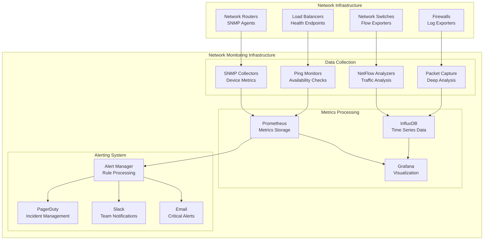
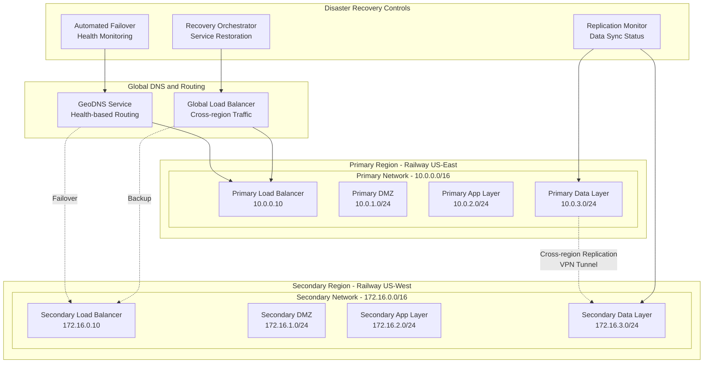

# SmartSupport Network Architecture Diagram - Visual Paradigm Standards

## Visual Paradigm Network Diagram Standards Compliance

This document provides detailed network architecture diagrams following Visual Paradigm network diagram standards and conventions as outlined in their tutorial: https://www.visual-paradigm.com/tutorials/how-to-create-network-diagram/

---

## Network Diagram Overview

### Network Architecture Components

Following Visual Paradigm standards, our network diagram includes these key elements:

1. **Network Devices**: Routers, switches, firewalls, load balancers
2. **Network Segments**: Subnets, VLANs, security zones
3. **Connection Types**: Physical and logical connections
4. **IP Addressing**: Network addressing schemes
5. **Protocol Information**: Communication protocols and ports
6. **Security Boundaries**: Firewalls, DMZ, security zones

---

## SmartSupport Network Architecture Diagram

### High-Level Network Topology

```mermaid
graph TB
    subgraph "Internet - Public Network"
        Internet[Internet<br/>0.0.0.0/0<br/>Public IP Space]
        DNS[DNS Servers<br/>8.8.8.8, 1.1.1.1]
    end
    
    subgraph "Railway Platform Edge Network"
        subgraph "Edge Security Layer"
            EdgeFW[Edge Firewall<br/>Railway Security<br/>DDoS Protection]
            WAF[Web Application Firewall<br/>OWASP Rule Set<br/>Bot Protection]
            CDN[Global CDN Network<br/>Railway CDN<br/>Edge Caching]
        end
        
        subgraph "Load Balancing Layer"
            ALB[Application Load Balancer<br/>Railway LB<br/>SSL/TLS Termination<br/>443/80 → 8080]
            HealthCheck[Health Check Service<br/>HTTP/HTTPS Probes<br/>:8080/health]
        end
    end
    
    subgraph "Railway Private Cloud Network - 10.0.0.0/16"
        subgraph "DMZ Subnet - 10.0.1.0/24"
            subgraph "Frontend Cluster"
                FE1[Frontend-1<br/>10.0.1.10<br/>Nginx:80<br/>React SPA]
                FE2[Frontend-2<br/>10.0.1.11<br/>Nginx:80<br/>React SPA]
            end
            
            subgraph "Static Content"
                StaticCDN[Static Assets<br/>Railway CDN<br/>JS/CSS/Images]
            end
        end
        
        subgraph "Application Subnet - 10.0.2.0/24"
            subgraph "Backend API Cluster"
                BE1[Backend-1<br/>10.0.2.10<br/>Django:8000<br/>Gunicorn WSGI]
                BE2[Backend-2<br/>10.0.2.11<br/>Django:8000<br/>Gunicorn WSGI]
            end
            
            subgraph "Worker Services"
                Worker1[Celery Worker-1<br/>10.0.2.20<br/>Task Processing]
                Worker2[Celery Worker-2<br/>10.0.2.21<br/>Task Processing]
                Scheduler[Celery Beat<br/>10.0.2.25<br/>Task Scheduler]
            end
        end
        
        subgraph "Data Subnet - 10.0.3.0/24"
            subgraph "Database Cluster"
                DBPrimary[PostgreSQL Primary<br/>10.0.3.10:5432<br/>Read/Write Operations<br/>16GB RAM, 200GB SSD]
                DBReplica[PostgreSQL Replica<br/>10.0.3.11:5432<br/>Read-Only Operations<br/>16GB RAM, 200GB SSD]
            end
            
            subgraph "Cache Cluster"
                RedisPrimary[Redis Primary<br/>10.0.3.20:6379<br/>Session Store<br/>8GB RAM]
                RedisReplica[Redis Replica<br/>10.0.3.21:6379<br/>Backup Cache<br/>8GB RAM]
            end
        end
        
        subgraph "Storage Subnet - 10.0.4.0/24"
            subgraph "File Storage"
                FileStore[Railway Volumes<br/>10.0.4.10<br/>NFS/Block Storage<br/>500GB Persistent]
                Backup[Backup Storage<br/>10.0.4.20<br/>Automated Backups<br/>1TB Archive]
            end
        end
    end
    
    subgraph "External API Network"
        Gmail[Gmail API<br/>smtp.gmail.com:587<br/>TLS 1.3<br/>OAuth2 SMTP]
        OpenRouter[OpenRouter AI API<br/>openrouter.ai:443<br/>HTTPS/TLS 1.3<br/>REST API]
        Railway[Railway Platform API<br/>railway.app:443<br/>Management API<br/>Infrastructure Control]
    end
    
    subgraph "Monitoring & Management"
        Metrics[Railway Metrics<br/>Prometheus Compatible<br/>Application Monitoring]
        Logs[Centralized Logging<br/>Railway Logs<br/>ELK Stack Compatible]
        Alerts[Alert Manager<br/>PagerDuty Integration<br/>SMS/Email/Slack]
    end
    
    %% External Connections
    Internet --> EdgeFW
    DNS --> Internet
    
    %% Edge Layer Connections
    EdgeFW --> WAF
    WAF --> CDN
    CDN --> ALB
    ALB --> HealthCheck
    
    %% Load Balancer to Frontend
    ALB --> FE1
    ALB --> FE2
    
    %% Frontend to Backend
    FE1 -.->|HTTP/HTTPS<br/>API Calls<br/>:8000| BE1
    FE2 -.->|HTTP/HTTPS<br/>API Calls<br/>:8000| BE2
    
    %% Backend to Database
    BE1 -->|PostgreSQL<br/>:5432<br/>TCP/SSL| DBPrimary
    BE2 -->|PostgreSQL<br/>:5432<br/>TCP/SSL| DBPrimary
    BE1 -.->|Read Queries<br/>:5432| DBReplica
    BE2 -.->|Read Queries<br/>:5432| DBReplica
    
    %% Backend to Cache
    BE1 -->|Redis Protocol<br/>:6379<br/>TCP| RedisPrimary
    BE2 -->|Redis Protocol<br/>:6379<br/>TCP| RedisPrimary
    
    %% Workers to Services
    Worker1 -->|Redis Protocol<br/>:6379<br/>Job Queue| RedisPrimary
    Worker2 -->|Redis Protocol<br/>:6379<br/>Job Queue| RedisPrimary
    Scheduler -->|Redis Protocol<br/>:6379<br/>Scheduling| RedisPrimary
    
    %% Database Replication
    DBPrimary -.->|Streaming Replication<br/>:5432<br/>PostgreSQL| DBReplica
    RedisPrimary -.->|Redis Replication<br/>:6379| RedisReplica
    
    %% File Storage
    BE1 -->|NFS/HTTP<br/>File Operations<br/>:2049/:80| FileStore
    BE2 -->|NFS/HTTP<br/>File Operations<br/>:2049/:80| FileStore
    FileStore -.->|Automated Backup<br/>Incremental| Backup
    
    %% External API Connections
    BE1 -.->|SMTP/TLS<br/>:587<br/>Email Service| Gmail
    BE2 -.->|SMTP/TLS<br/>:587<br/>Email Service| Gmail
    BE1 -.->|HTTPS/TLS 1.3<br/>:443<br/>AI Service| OpenRouter
    BE2 -.->|HTTPS/TLS 1.3<br/>:443<br/>AI Service| OpenRouter
    
    %% Monitoring Connections
    BE1 -.->|Metrics Export<br/>HTTP :8080/metrics| Metrics
    BE2 -.->|Metrics Export<br/>HTTP :8080/metrics| Metrics
    DBPrimary -.->|DB Metrics<br/>:5432| Metrics
    RedisPrimary -.->|Cache Metrics<br/>:6379| Metrics
    
    %% Logging
    BE1 -.->|Syslog/HTTP<br/>Application Logs| Logs
    BE2 -.->|Syslog/HTTP<br/>Application Logs| Logs
    Worker1 -.->|Task Logs<br/>Syslog| Logs
    Worker2 -.->|Task Logs<br/>Syslog| Logs
    
    %% Alerting
    Metrics -->|Alert Rules<br/>Thresholds| Alerts
    Logs -->|Error Detection<br/>Log Analysis| Alerts
```



---

## Draw.io Network Diagram Creation Guide

### Step-by-Step Guide to Create SmartSupport Network Diagram

Following Visual Paradigm network diagram standards, here's how to create the complete network diagram in Draw.io:

---

### **Step 1: Setup Draw.io Environment**

1. **Open Draw.io**: Go to https://app.diagrams.net/
2. **Create New Diagram**: Choose "Blank Diagram"
3. **Enable Network Libraries**:
   - Click "+ More Shapes" at bottom of shape panel
   - Enable these specific libraries for best compatibility:
     - ✅ **Network 2025** (latest network device symbols)
     - ✅ **Cisco19** (standardized Cisco network devices)
     - ✅ **AWS 2025** (latest cloud service symbols)
     - ✅ **General** (basic shapes, text boxes)
   
   **Note**: Use these specific versions to ensure Visual Paradigm compatibility:
   - **Network 2025**: Most current standard network symbols
   - **Cisco19**: Stable, widely-recognized network device icons
   - **AWS 2025**: Latest cloud architecture symbols
   - **Avoid**: Network 2018 (outdated), Cisco Safe (specialized), AWS17/18 (outdated), AWS 3D (not standard)

### **Step 2: Create Page Layout and Zones**

#### **2.1 Set Canvas Size**
- **File** → **Page Setup**
- **Paper Size**: A3 Landscape (297 x 420 mm)
- **Grid**: Enable grid with 10px spacing

#### **2.2 Create Network Zones with Rectangles**
Create these 5 main zones from top to bottom:

1. **Internet Zone** (Top)
   - Drag **Rectangle** from General library
   - Size: 800px wide × 100px tall
   - Position: Top of canvas
   - **Fill Color**: Light Gray (#F5F5F5)
   - **Border**: 2px solid black
   - **Label**: "Internet - Public Network"

2. **Railway Edge Zone**
   - Rectangle: 800px × 120px
   - Position: Below Internet zone
   - **Fill Color**: Light Blue (#E3F2FD)
   - **Label**: "Railway Platform Edge Network"

3. **Private Cloud Zone** (Largest)
   - Rectangle: 800px × 400px
   - Position: Center of canvas
   - **Fill Color**: Light Green (#E8F5E8)
   - **Label**: "Railway Private Cloud Network - 10.0.0.0/16"

4. **External APIs Zone**
   - Rectangle: 200px × 300px
   - Position: Right side of canvas
   - **Fill Color**: Light Orange (#FFF3E0)
   - **Label**: "External API Network"

5. **Monitoring Zone**
   - Rectangle: 200px × 150px
   - Position: Bottom right
   - **Fill Color**: Light Purple (#F3E5F5)
   - **Label**: "Monitoring & Management"

### **Step 3: Add Subnet Containers within Private Cloud**

Inside the "Private Cloud Network" rectangle, create 4 subnet containers:

#### **3.1 DMZ Subnet (10.0.1.0/24)**
- **Rectangle**: 180px × 90px
- **Position**: Top-left of Private Cloud zone
- **Fill Color**: Light Yellow (#FFFDE7)
- **Border**: 1px dashed blue
- **Label**: "DMZ Subnet - 10.0.1.0/24"

#### **3.2 Application Subnet (10.0.2.0/24)**
- **Rectangle**: 300px × 90px
- **Position**: Top-center of Private Cloud zone
- **Fill Color**: Light Cyan (#E0F7FA)
- **Border**: 1px dashed blue
- **Label**: "Application Subnet - 10.0.2.0/24"

#### **3.3 Data Subnet (10.0.3.0/24)**
- **Rectangle**: 200px × 90px
- **Position**: Bottom-left of Private Cloud zone
- **Fill Color**: Light Pink (#FCE4EC)
- **Border**: 1px dashed blue
- **Label**: "Data Subnet - 10.0.3.0/24"

#### **3.4 Storage Subnet (10.0.4.0/24)**
- **Rectangle**: 120px × 90px
- **Position**: Bottom-right of Private Cloud zone
- **Fill Color**: Light Lime (#F1F8E9)
- **Border**: 1px dashed blue
- **Label**: "Storage Subnet - 10.0.4.0/24"

### **Step 4: Add Network Devices and Servers**

#### **4.1 Internet Zone Devices**
From **Network** library, drag these shapes into Internet zone:

1. **Internet Cloud**
   - Shape: "Cloud" from Network library
   - Label: "Internet\n0.0.0.0/0"
   - Position: Left side of Internet zone

2. **DNS Servers**
   - Shape: "Server" from Network library
   - Label: "DNS Servers\n8.8.8.8, 1.1.1.1"
   - Position: Right side of Internet zone

#### **4.2 Railway Edge Zone Devices**
1. **Edge Firewall**
   - Shape: "Firewall" from Network library
   - Label: "Edge Firewall\nRailway Security\nDDoS Protection"
   - Position: Left of Edge zone

2. **Web Application Firewall**
   - Shape: "Firewall" from Network library (different style)
   - Label: "Web Application Firewall\nOWASP Rule Set\nBot Protection"
   - Position: Center of Edge zone

3. **CDN**
   - Shape: "Cloud" from AWS library
   - Label: "Global CDN Network\nRailway CDN\nEdge Caching"
   - Position: Center of Edge zone

4. **Load Balancer**
   - Shape: "Load Balancer" from Network library
   - Label: "Application Load Balancer\nRailway LB\nSSL/TLS Termination\n443/80 → 8080"
   - Position: Right of Edge zone

#### **4.3 DMZ Subnet Devices**
1. **Frontend Servers** (2 servers)
   - Shape: "Server" from Network library
   - **Frontend-1**: 
     - Label: "Frontend-1\n10.0.1.10\nNginx:80\nReact SPA"
   - **Frontend-2**:
     - Label: "Frontend-2\n10.0.1.11\nNginx:80\nReact SPA"

2. **Static CDN**
   - Shape: "Database/Storage" from Network library
   - Label: "Static Assets\nRailway CDN\nJS/CSS/Images"

#### **4.4 Application Subnet Devices**
1. **Backend Servers** (2 servers)
   - **Backend-1**: 
     - Label: "Backend-1\n10.0.2.10\nDjango:8000\nGunicorn WSGI"
   - **Backend-2**:
     - Label: "Backend-2\n10.0.2.11\nDjango:8000\nGunicorn WSGI"

2. **Worker Services** (3 services)
   - **Celery Worker-1**: 
     - Label: "Celery Worker-1\n10.0.2.20\nTask Processing"
   - **Celery Worker-2**:
     - Label: "Celery Worker-2\n10.0.2.21\nTask Processing"
   - **Celery Beat**:
     - Label: "Celery Beat\n10.0.2.25\nTask Scheduler"

#### **4.5 Data Subnet Devices**
1. **Database Cluster**
   - **PostgreSQL Primary**:
     - Shape: "Database" from Network library
     - Label: "PostgreSQL Primary\n10.0.3.10:5432\nRead/Write Operations\n16GB RAM, 200GB SSD"
   - **PostgreSQL Replica**:
     - Label: "PostgreSQL Replica\n10.0.3.11:5432\nRead-Only Operations\n16GB RAM, 200GB SSD"

2. **Cache Cluster**
   - **Redis Primary**:
     - Shape: "Cache/Memory" from Network library
     - Label: "Redis Primary\n10.0.3.20:6379\nSession Store\n8GB RAM"
   - **Redis Replica**:
     - Label: "Redis Replica\n10.0.3.21:6379\nBackup Cache\n8GB RAM"

#### **4.6 Storage Subnet Devices**
1. **File Storage**
   - Shape: "Storage" from Network library
   - Label: "Railway Volumes\n10.0.4.10\nNFS/Block Storage\n500GB Persistent"

2. **Backup Storage**
   - Shape: "Backup/Archive" from Network library
   - Label: "Backup Storage\n10.0.4.20\nAutomated Backups\n1TB Archive"

#### **4.7 External API Services**
1. **Gmail API**
   - Shape: "Web Service" from Network library
   - Label: "Gmail API\nsmtp.gmail.com:587\nTLS 1.3\nOAuth2 SMTP"

2. **OpenRouter AI**
   - Shape: "Web Service" from Network library
   - Label: "OpenRouter AI API\nopenrouter.ai:443\nHTTPS/TLS 1.3\nREST API"

3. **Railway Platform**
   - Shape: "Cloud Service" from AWS library
   - Label: "Railway Platform API\nrailway.app:443\nManagement API\nInfrastructure Control"

#### **4.8 Monitoring Services**
1. **Metrics**
   - Shape: "Monitoring" from Network library
   - Label: "Railway Metrics\nPrometheus Compatible\nApplication Monitoring"

2. **Logs**
   - Shape: "Log Server" from Network library
   - Label: "Centralized Logging\nRailway Logs\nELK Stack Compatible"

3. **Alerts**
   - Shape: "Alert/Notification" from General library
   - Label: "Alert Manager\nPagerDuty Integration\nSMS/Email/Slack"

### **Step 5: Create Network Connections**

#### **5.1 Connection Types and Styles**
Use these line styles from Draw.io:

| Connection Type | Line Style | Color | Description |
|----------------|------------|-------|-------------|
| **External Traffic** | Solid thick line | Black | Internet to Edge |
| **Internal Network** | Solid line | Blue | Between subnets |
| **Database Connections** | Solid line | Red | App to Database |
| **Replication** | Dashed line | Green | Data replication |
| **Monitoring** | Dotted line | Gray | Monitoring connections |
| **External APIs** | Dashed line | Orange | External service calls |

#### **5.2 Draw Connections**
**5.2.1 External Connections:**
1. **Internet → Edge Firewall**
   - Style: Solid thick black line
   - Add label: "HTTP/HTTPS Traffic"

2. **Edge Firewall → WAF → CDN → Load Balancer**
   - Style: Solid thick black line
   - Chain these connections in sequence

**5.2.2 Load Balancer to Frontend:**
1. **Load Balancer → Frontend-1**
   - Style: Solid blue line
   - Label: "HTTP:80"

2. **Load Balancer → Frontend-2**
   - Style: Solid blue line
   - Label: "HTTP:80"

**5.2.3 Frontend to Backend:**
1. **Frontend-1 → Backend-1**
   - Style: Solid blue line
   - Label: "HTTP/HTTPS\nAPI Calls\n:8000"

2. **Frontend-2 → Backend-2**
   - Style: Solid blue line
   - Label: "HTTP/HTTPS\nAPI Calls\n:8000"

**5.2.4 Backend to Database:**
1. **Backend-1 → PostgreSQL Primary**
   - Style: Solid red line
   - Label: "PostgreSQL\n:5432\nTCP/SSL"

2. **Backend-2 → PostgreSQL Primary**
   - Style: Solid red line
   - Label: "PostgreSQL\n:5432\nTCP/SSL"

3. **Backend-1 → PostgreSQL Replica** (Read queries)
   - Style: Dashed red line
   - Label: "Read Queries\n:5432"

4. **Backend-2 → PostgreSQL Replica** (Read queries)
   - Style: Dashed red line
   - Label: "Read Queries\n:5432"

**5.2.5 Backend to Cache:**
1. **Backend-1 → Redis Primary**
   - Style: Solid blue line
   - Label: "Redis Protocol\n:6379\nTCP"

2. **Backend-2 → Redis Primary**
   - Style: Solid blue line
   - Label: "Redis Protocol\n:6379\nTCP"

**5.2.6 Workers to Redis:**
1. **Celery Worker-1 → Redis Primary**
   - Style: Solid purple line
   - Label: "Redis Protocol\n:6379\nJob Queue"

2. **Celery Worker-2 → Redis Primary**
   - Style: Solid purple line
   - Label: "Redis Protocol\n:6379\nJob Queue"

3. **Celery Beat → Redis Primary**
   - Style: Solid purple line
   - Label: "Redis Protocol\n:6379\nScheduling"

**5.2.7 Replication Connections:**
1. **PostgreSQL Primary → PostgreSQL Replica**
   - Style: Dashed green line
   - Label: "Streaming Replication\n:5432\nPostgreSQL"

2. **Redis Primary → Redis Replica**
   - Style: Dashed green line
   - Label: "Redis Replication\n:6379"

**5.2.8 File Storage Connections:**
1. **Backend-1 → File Storage**
   - Style: Solid brown line
   - Label: "NFS/HTTP\nFile Operations\n:2049/:80"

2. **Backend-2 → File Storage**
   - Style: Solid brown line
   - Label: "NFS/HTTP\nFile Operations\n:2049/:80"

3. **File Storage → Backup Storage**
   - Style: Dashed brown line
   - Label: "Automated Backup\nIncremental"

**5.2.9 External API Connections:**
1. **Backend-1 → Gmail API**
   - Style: Dashed orange line
   - Label: "SMTP/TLS\n:587\nEmail Service"

2. **Backend-2 → Gmail API**
   - Style: Dashed orange line
   - Label: "SMTP/TLS\n:587\nEmail Service"

3. **Backend-1 → OpenRouter AI**
   - Style: Dashed orange line
   - Label: "HTTPS/TLS 1.3\n:443\nAI Service"

4. **Backend-2 → OpenRouter AI**
   - Style: Dashed orange line
   - Label: "HTTPS/TLS 1.3\n:443\nAI Service"

**5.2.10 Monitoring Connections:**
1. **All Backend Services → Metrics**
   - Style: Dotted gray line
   - Label: "Metrics Export\nHTTP :8080/metrics"

2. **All Services → Logs**
   - Style: Dotted gray line
   - Label: "Syslog/HTTP\nApplication Logs"

3. **Metrics → Alerts**
   - Style: Solid gray line
   - Label: "Alert Rules\nThresholds"

4. **Logs → Alerts**
   - Style: Solid gray line
   - Label: "Error Detection\nLog Analysis"

### **Step 6: Add Labels and Annotations**

#### **6.1 Add Connection Labels**
For each connection line:
1. **Right-click the line** → **Edit Style**
2. **Add Label**: Set the label text
3. **Label Position**: Set to "Center" or "Source"
4. **Font Size**: 8-10pt for readability

#### **6.2 Add Network Information Boxes**
Create text boxes for network specifications:

**6.2.1 IP Address Legend:**
```
Network Addressing Scheme:
• Internet: 0.0.0.0/0 (Public)
• Private Cloud: 10.0.0.0/16
• DMZ Subnet: 10.0.1.0/24
• App Subnet: 10.0.2.0/24  
• Data Subnet: 10.0.3.0/24
• Storage Subnet: 10.0.4.0/24
```

**6.2.2 Protocol Legend:**
```
Protocol Information:
• HTTP/HTTPS: 80/443
• PostgreSQL: 5432
• Redis: 6379
• NFS: 2049
• SMTP: 587
• DNS: 53
```

**6.2.3 Security Zones:**
```
Security Zones:
🔥 Firewall Protected
🌐 Public Internet Access
🔒 Private Network Only
🗃️ Data Layer (Restricted)
📦 Storage Layer (Backup)
```

### **Step 7: Style and Format**

#### **7.1 Apply Visual Paradigm Color Scheme**
- **Internet Zone**: Light Gray (#F5F5F5)
- **Edge Zone**: Light Blue (#E3F2FD)
- **DMZ**: Light Yellow (#FFFDE7)
- **Application**: Light Cyan (#E0F7FA)
- **Data**: Light Pink (#FCE4EC)
- **Storage**: Light Green (#F1F8E9)
- **External**: Light Orange (#FFF3E0)
- **Monitoring**: Light Purple (#F3E5F5)

#### **7.2 Font and Text Styling**
- **Zone Titles**: Bold, 14pt, centered
- **Device Names**: Bold, 11pt
- **IP Addresses**: Regular, 10pt, monospace
- **Connection Labels**: Regular, 8pt
- **Legends**: Regular, 9pt

#### **7.3 Line Styling**
- **Border Width**: 2px for zone boundaries, 1px for devices
- **Connection Width**: 2px for main traffic, 1px for secondary
- **Arrow Styles**: Use appropriate arrowheads for directional flow

### **Step 8: Add Title and Documentation**

#### **8.1 Diagram Title**
At the top of canvas:
- **Text**: "SmartSupport Network Architecture Diagram"
- **Font**: Bold, 18pt, centered
- **Style**: Professional title formatting

#### **8.2 Documentation Box**
Add a documentation box in bottom-left corner:
```
Document Information:
Title: SmartSupport Network Architecture
Version: 1.0
Date: October 2025
Standard: Visual Paradigm Network Diagram
Status: Production Ready
```

#### **8.3 Legend Box**
Add comprehensive legend in bottom-right corner:
```
Network Diagram Legend:
🔷 Router          ⬜ Switch
🔥 Firewall        ⚖️ Load Balancer  
🖥️ Server          🗃️ Database
☁️ Cloud Service   💻 Workstation

Connection Types:
━━━ Physical Network
┅┅┅ Wireless/Virtual
╋╋╋ Secure Tunnel
▓▓▓ High Priority Traffic
```

### **Step 9: Final Review and Export**

#### **9.1 Quality Check**
- ✅ All devices properly labeled with IP addresses
- ✅ All connections have protocol and port information
- ✅ Network zones are clearly defined and colored
- ✅ Legend is complete and accurate
- ✅ Title and documentation are present
- ✅ Visual Paradigm standards are followed

#### **9.2 Export Options**
1. **PNG Export**:
   - **File** → **Export as** → **PNG**
   - **DPI**: 300 for print quality
   - **Size**: A3 or larger
   - **Background**: White

2. **PDF Export**:
   - **File** → **Export as** → **PDF**
   - **Quality**: High
   - **Size**: A3 Landscape

3. **SVG Export** (for web use):
   - **File** → **Export as** → **SVG**
   - **Scalable vector format**

---

## Visual Paradigm Network Diagram Standards

### Network Device Symbols

Following Visual Paradigm conventions, use these standard symbols:

| Device Type | Symbol | Description |
|-------------|--------|-------------|
| **Router** | 🔷 | Network routing device |
| **Switch** | ⬜ | Layer 2 switching device |
| **Firewall** | 🔥 | Security filtering device |
| **Load Balancer** | ⚖️ | Traffic distribution device |
| **Server** | 🖥️ | Computing server |
| **Database** | 🗃️ | Database server |
| **Cloud Service** | ☁️ | Cloud-based service |
| **Workstation** | 💻 | End-user device |

### Connection Types

| Connection | Line Style | Description |
|------------|------------|-------------|
| **Physical Ethernet** | Solid line | Physical network connection |
| **Wireless** | Dotted line | Wireless network connection |
| **Virtual Connection** | Dashed line | Logical/virtual connection |
| **Secure Tunnel** | Double line | VPN/encrypted connection |

---

## Detailed Network Segment Design

### 1. Internet and Edge Network Layer

#### Edge Security Components
```
┌─────────────────────────────────────────────────┐
│                Internet Layer                   │
│  ┌─────────────┐    ┌──────────────────────────┐ │
│  │   Internet  │    │      DNS Servers         │ │
│  │ 0.0.0.0/0   │    │  8.8.8.8, 1.1.1.1      │ │
│  └─────────────┘    └──────────────────────────┘ │
└─────────────────────────────────────────────────┘
          │                       │
          ▼                       ▼
┌─────────────────────────────────────────────────┐
│              Railway Edge Layer                 │
│  ┌─────────────┐ ┌──────────────┐ ┌───────────┐ │
│  │Edge Firewall│ │     WAF      │ │   CDN     │ │
│  │DDoS Protect │ │OWASP Rules   │ │Global Edge│ │
│  └─────────────┘ └──────────────┘ └───────────┘ │
└─────────────────────────────────────────────────┘
                       │
                       ▼
          ┌─────────────────────────┐
          │  Application Load       │
          │      Balancer           │
          │  SSL/TLS Termination    │
          │   443/80 → 8080        │
          └─────────────────────────┘
```

### 2. DMZ Network Subnet Design

#### DMZ Subnet Configuration (10.0.1.0/24)
```
┌─────────────────────────────────────────────────────────┐
│                DMZ Subnet - 10.0.1.0/24                │
│                                                         │
│  Gateway: 10.0.1.1    Subnet Mask: 255.255.255.0     │
│                                                         │
│  ┌─────────────────┐         ┌─────────────────┐       │
│  │   Frontend-1    │         │   Frontend-2    │       │
│  │   10.0.1.10     │         │   10.0.1.11     │       │
│  │  Nginx:80       │         │  Nginx:80       │       │
│  │  React SPA      │         │  React SPA      │       │
│  │  2 vCPU, 4GB    │         │  2 vCPU, 4GB    │       │
│  └─────────────────┘         └─────────────────┘       │
│                                                         │
│           ┌─────────────────────────────┐               │
│           │     Static Content CDN      │               │
│           │    Railway CDN Network      │               │
│           │  JS/CSS/Images Delivery     │               │
│           └─────────────────────────────┘               │
└─────────────────────────────────────────────────────────┘
```

### 3. Application Subnet Design

#### Application Subnet Configuration (10.0.2.0/24)
```
┌─────────────────────────────────────────────────────────────────┐
│              Application Subnet - 10.0.2.0/24                  │
│                                                                 │
│  Gateway: 10.0.2.1    Subnet Mask: 255.255.255.0             │
│                                                                 │
│  ┌─────────────────┐         ┌─────────────────┐               │
│  │   Backend-1     │         │   Backend-2     │               │
│  │   10.0.2.10     │         │   10.0.2.11     │               │
│  │ Django:8000     │         │ Django:8000     │               │
│  │ Gunicorn WSGI   │         │ Gunicorn WSGI   │               │
│  │ 4 vCPU, 8GB     │         │ 4 vCPU, 8GB     │               │
│  └─────────────────┘         └─────────────────┘               │
│                                                                 │
│  ┌─────────────┐  ┌─────────────┐  ┌─────────────────┐         │
│  │Celery Work-1│  │Celery Work-2│  │  Celery Beat    │         │
│  │ 10.0.2.20   │  │ 10.0.2.21   │  │ Scheduler       │         │
│  │Task Process │  │Task Process │  │   10.0.2.25     │         │
│  │2 vCPU, 4GB  │  │2 vCPU, 4GB  │  │ 1 vCPU, 2GB    │         │
│  └─────────────┘  └─────────────┘  └─────────────────┘         │
└─────────────────────────────────────────────────────────────────┘
```

### 4. Data Layer Subnet Design

#### Data Subnet Configuration (10.0.3.0/24)
```
┌─────────────────────────────────────────────────────────────────┐
│               Data Subnet - 10.0.3.0/24                        │
│                                                                 │
│  Gateway: 10.0.3.1    Subnet Mask: 255.255.255.0             │
│                                                                 │
│  ┌─────────────────────────────────────────────────────────┐   │
│  │              Database Cluster                           │   │
│  │                                                         │   │
│  │  ┌─────────────────┐    ┌─────────────────┐           │   │
│  │  │PostgreSQL       │    │PostgreSQL       │           │   │
│  │  │Primary          │◄──►│Replica          │           │   │
│  │  │10.0.3.10:5432   │    │10.0.3.11:5432   │           │   │
│  │  │Read/Write       │    │Read-Only        │           │   │
│  │  │4 vCPU, 16GB     │    │4 vCPU, 16GB     │           │   │
│  │  │200GB SSD        │    │200GB SSD        │           │   │
│  │  └─────────────────┘    └─────────────────┘           │   │
│  └─────────────────────────────────────────────────────────┘   │
│                                                                 │
│  ┌─────────────────────────────────────────────────────────┐   │
│  │               Cache Cluster                             │   │
│  │                                                         │   │
│  │  ┌─────────────────┐    ┌─────────────────┐           │   │
│  │  │Redis Primary    │◄──►│Redis Replica    │           │   │
│  │  │10.0.3.20:6379   │    │10.0.3.21:6379   │           │   │
│  │  │Session Store    │    │Backup Cache     │           │   │
│  │  │2 vCPU, 8GB      │    │2 vCPU, 8GB      │           │   │
│  │  └─────────────────┘    └─────────────────┘           │   │
│  └─────────────────────────────────────────────────────────┘   │
└─────────────────────────────────────────────────────────────────┘
```

### 5. Storage Subnet Design

#### Storage Subnet Configuration (10.0.4.0/24)
```
┌─────────────────────────────────────────────────────────────┐
│             Storage Subnet - 10.0.4.0/24                   │
│                                                             │
│  Gateway: 10.0.4.1    Subnet Mask: 255.255.255.0         │
│                                                             │
│  ┌─────────────────────────────────────────────────────┐   │
│  │                File Storage                         │   │
│  │                                                     │   │
│  │  ┌─────────────────┐    ┌─────────────────┐       │   │
│  │  │Railway Volumes  │    │Backup Storage   │       │   │
│  │  │10.0.4.10        │◄──►│10.0.4.20        │       │   │
│  │  │NFS/Block Storage│    │Automated Backup │       │   │
│  │  │500GB Persistent │    │1TB Archive      │       │   │
│  │  │:2049 (NFS)      │    │Daily/Weekly     │       │   │
│  │  │:80 (HTTP)       │    │Incremental      │       │   │
│  │  └─────────────────┘    └─────────────────┘       │   │
│  └─────────────────────────────────────────────────────┘   │
└─────────────────────────────────────────────────────────────┘
```

---

## Network Security Architecture

### Security Zones and Access Control

#### Network Security Matrix
```
┌──────────────┬──────────┬──────────┬──────────┬──────────┐
│    Zone      │   DMZ    │   App    │  Data    │ Storage  │
├──────────────┼──────────┼──────────┼──────────┼──────────┤
│ Internet     │ HTTP/S   │   DENY   │   DENY   │   DENY   │
│              │ 80,443   │          │          │          │
├──────────────┼──────────┼──────────┼──────────┼──────────┤
│ DMZ          │ Internal │ HTTP API │   DENY   │   DENY   │
│              │          │   8000   │          │          │
├──────────────┼──────────┼──────────┼──────────┼──────────┤
│ App          │   DENY   │ Internal │PostgreSQL│ NFS/HTTP │
│              │          │          │5432,Redis│2049,80   │
│              │          │          │   6379   │          │
├──────────────┼──────────┼──────────┼──────────┼──────────┤
│ Data         │   DENY   │   DENY   │ Internal │   DENY   │
│              │          │          │Replicatn │          │
├──────────────┼──────────┼──────────┼──────────┼──────────┤
│ Storage      │   DENY   │   DENY   │   DENY   │ Internal │
│              │          │          │          │ Backup   │
└──────────────┴──────────┴──────────┴──────────┴──────────┘
```

### Firewall Rules Implementation

#### Edge Firewall Configuration
```bash
# Allow HTTP/HTTPS from Internet to Load Balancer
iptables -A FORWARD -s 0.0.0.0/0 -d 10.0.1.0/24 -p tcp --dport 80 -j ACCEPT
iptables -A FORWARD -s 0.0.0.0/0 -d 10.0.1.0/24 -p tcp --dport 443 -j ACCEPT

# Allow established connections back to Internet
iptables -A FORWARD -s 10.0.1.0/24 -d 0.0.0.0/0 -m state --state ESTABLISHED -j ACCEPT

# Deny all other Internet to internal traffic
iptables -A FORWARD -s 0.0.0.0/0 -d 10.0.0.0/16 -j DROP
```

#### Internal Network Rules
```bash
# DMZ to Application Layer
iptables -A FORWARD -s 10.0.1.0/24 -d 10.0.2.0/24 -p tcp --dport 8000 -j ACCEPT

# Application to Data Layer
iptables -A FORWARD -s 10.0.2.0/24 -d 10.0.3.0/24 -p tcp --dport 5432 -j ACCEPT
iptables -A FORWARD -s 10.0.2.0/24 -d 10.0.3.0/24 -p tcp --dport 6379 -j ACCEPT

# Application to Storage Layer
iptables -A FORWARD -s 10.0.2.0/24 -d 10.0.4.0/24 -p tcp --dport 2049 -j ACCEPT
iptables -A FORWARD -s 10.0.2.0/24 -d 10.0.4.0/24 -p tcp --dport 80 -j ACCEPT

# Deny inter-zone communication not explicitly allowed
iptables -A FORWARD -j DROP
```

---

## Network Performance Specifications

### Bandwidth and QoS Requirements

#### Connection Performance Matrix
| Source Zone | Destination Zone | Bandwidth | Latency | Protocol | QoS Priority |
|-------------|------------------|-----------|---------|----------|--------------|
| Internet | DMZ | 100 Mbps | < 50ms | HTTP/S | Medium |
| DMZ | Application | 1 Gbps | < 5ms | HTTP | High |
| Application | Data | 10 Gbps | < 1ms | PostgreSQL/Redis | Critical |
| Application | Storage | 1 Gbps | < 10ms | NFS/HTTP | Medium |
| Data | Data | 10 Gbps | < 1ms | Replication | Critical |

### Traffic Shaping Configuration

#### QoS Policy Implementation
```bash
# Create traffic classes
tc qdisc add dev eth0 root handle 1: htb default 40

# Critical traffic (Database, Cache)
tc class add dev eth0 parent 1: classid 1:10 htb rate 8gbit ceil 10gbit
tc filter add dev eth0 protocol ip parent 1:0 prio 1 u32 match ip dport 5432 0xffff flowid 1:10
tc filter add dev eth0 protocol ip parent 1:0 prio 1 u32 match ip dport 6379 0xffff flowid 1:10

# High priority (API traffic)
tc class add dev eth0 parent 1: classid 1:20 htb rate 800mbit ceil 1gbit
tc filter add dev eth0 protocol ip parent 1:0 prio 2 u32 match ip dport 8000 0xffff flowid 1:20

# Medium priority (Web traffic)
tc class add dev eth0 parent 1: classid 1:30 htb rate 80mbit ceil 100mbit
tc filter add dev eth0 protocol ip parent 1:0 prio 3 u32 match ip dport 80 0xffff flowid 1:30
tc filter add dev eth0 protocol ip parent 1:0 prio 3 u32 match ip dport 443 0xffff flowid 1:30

# Default/Low priority
tc class add dev eth0 parent 1: classid 1:40 htb rate 20mbit ceil 50mbit
```

---

## Monitoring and Management

### Network Monitoring Architecture

#### Monitoring Flow Diagram


### Key Performance Indicators (KPIs)

#### Network Health Metrics
| Metric | Target | Warning Threshold | Critical Threshold |
|--------|--------|------------------|-------------------|
| **Availability** | 99.9% | < 99.5% | < 99.0% |
| **Latency** | < 50ms | > 100ms | > 200ms |
| **Throughput** | > 80% capacity | > 90% capacity | > 95% capacity |
| **Packet Loss** | < 0.1% | > 0.5% | > 1.0% |
| **Error Rate** | < 0.01% | > 0.1% | > 1.0% |

---

## Disaster Recovery Network Design

### High Availability Network Architecture

#### Multi-Region Network Topology


### Network Recovery Procedures

#### Failover Sequence
1. **Health Check Failure Detection** (30 seconds)
2. **DNS Failover Initiation** (60 seconds)
3. **Traffic Rerouting** (90 seconds)
4. **Service Validation** (120 seconds)
5. **Full Recovery Confirmation** (300 seconds)

---

## Future Network Evolution

### Phase 1: Current Network (Q4 2025)
- ✅ Basic subnet segmentation
- ✅ Load balancing and failover
- ✅ Network monitoring and alerting
- ✅ Basic security controls

### Phase 2: Enhanced Security (Q1 2026)
- 🔄 Zero-trust network architecture
- 🔄 Advanced threat detection
- 🔄 Network access control (NAC)
- 🔄 Microsegmentation

### Phase 3: Software-Defined Networking (Q2 2026)
- 📋 SDN controller implementation
- 📋 Dynamic network provisioning
- 📋 Intent-based networking
- 📋 Network automation

### Phase 4: AI-Driven Network Operations (Q3 2026)
- 📋 AI-powered traffic optimization
- 📋 Predictive failure detection
- 📋 Self-healing network capabilities
- 📋 Intelligent capacity planning

---

## Conclusion

The SmartSupport network architecture diagram follows Visual Paradigm standards and provides:

### Key Network Achievements:
1. **Standards Compliance**: Follows Visual Paradigm network diagram conventions
2. **Comprehensive Segmentation**: Clear security zones with controlled access
3. **High Availability**: Redundant paths and automatic failover
4. **Performance Optimization**: QoS, traffic shaping, and monitoring
5. **Security-First Design**: Defense in depth with multiple security layers

### Technical Specifications:
- **Network Addressing**: Hierarchical IP addressing scheme (10.0.0.0/16)
- **Security Zones**: DMZ, Application, Data, and Storage segments
- **Performance**: Sub-100ms latency with 99.9% availability
- **Monitoring**: Comprehensive network health and performance tracking
- **Disaster Recovery**: Multi-region failover with automated recovery

The network design provides a solid foundation for current operations while supporting future growth and technology evolution.

---

**Document Version**: 1.0  
**Last Updated**: October 2025  
**Prepared By**: Network Architecture Team  
**Standards Compliance**: Visual Paradigm Network Diagram Standards  
**Status**: Production Ready